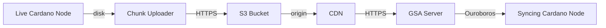

# Hosting a Genesis Sync Accelerator (GSA)

This guide explains how to set up and host a Genesis Sync Accelerator to provide fast, reliable blockchain data for syncing Cardano nodes.

## Architecture Overview

A complete GSA hosting setup involves four main components:

1.  **Live Cardano Node:** A standard relay node that is already synced to the tip of the network.
2.  **Chunk Uploader:** A service that watches the Live Node's `immutable/` directory and uploads finalized chunks to S3-compatible storage.
3.  **CDN (Content Delivery Network):** A globally distributed caching layer (e.g., CloudFront, Cloudflare R2, Fastly) that serves the static files from S3.
4.  **GSA Server:** A lightweight proxy that fetches data from the CDN and serves it to syncing nodes via Ouroboros protocols.



---

## Step 1: Provisioning Data (Chunk Uploader)

The `chunk-uploader` tool pushes ImmutableDB chunks (`.chunk`, `.primary`, `.secondary`) and a metadata file (`tip.json`) to S3.

### Running the Uploader

Run this on the same machine as your live Cardano node:

```bash
chunk-uploader 
  --immutable-dir /path/to/cardano-node/db/immutable 
  --s3-bucket my-cardano-cdn 
  --s3-region us-east-1 
  --s3-prefix mainnet/
```

- **Wait for Finalization:** The uploader only pushes *finalized* chunks (chunk $N$ is uploaded only when chunk $N+1$ exists).
- **State File:** It maintains a `.chunk-uploader-state` file in the immutable directory to track progress.

---

## Step 2: Storage & CDN Configuration

### S3-Compatible Storage
You can use AWS S3, Cloudflare R2, MinIO, or any S3-compatible service.
- **Permissions:** The bucket must allow public read access for the files uploaded by the uploader.
- **Organization:** Use a prefix like `mainnet/` to separate different networks.

### CDN Setup
Point your CDN to the S3 bucket as its origin.
- **Caching:** Enable long-term caching for `.chunk`, `.primary`, and `.secondary` files (they are immutable and never change).
- **Tip Caching:** The `tip.json` file changes more often and benefits from shorter term caching. The shorter its caching window, the faster new chunks may be picked up byt the GSA.

---

## Step 3: Running the GSA Server

The `genesis-sync-accelerator` binary is the actual protocol proxy.

### Configuration

| Flag | Description |
|---|---|
| `--rs-src-url` | The URL of your CDN (e.g., `https://cdn.example.com/mainnet`) |
| `--cache-dir` | Local path to store downloaded chunks |
| `--config` | Cardano node configuration file |
| `--port` | Port to listen on (default: 3001) |

### Example Command

```bash
genesis-sync-accelerator 
  --config /path/to/mainnet-config.json 
  --rs-src-url https://my-cdn.com/mainnet 
  --cache-dir /var/cache/gsa 
  --max-cached-chunks 50 
  --prefetch-ahead 5
```

---

## Operations & Monitoring

### Prefetching and Cache Tuning
- **`--max-cached-chunks`**: Increase this if you serve many peers simultaneously to reduce CDN hits.
- **`--prefetch-ahead`**: Increase this (e.g., to 5 or 10) if the latency between the GSA and the CDN is high.

### Monitoring
Monitor the GSA's logs for `TraceDownloadFailure` or `TraceDownloadException`, which indicate issues reaching the CDN.
