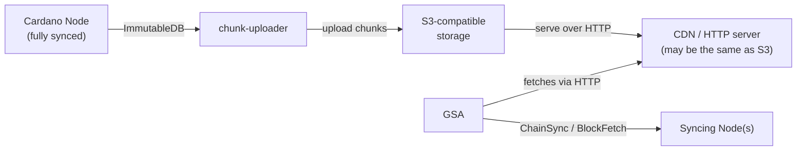

# Hosting a Genesis Sync Accelerator

This guide covers everything needed to stand up your own Genesis Sync Accelerator (GSA) instance and serve chain data to syncing Cardano nodes.

## Overview

Hosting a GSA involves three components working together:



1. A **fully-synced Cardano node** provides the source chain data.
2. The **chunk-uploader** watches the node's ImmutableDB and uploads completed chunks to S3-compatible storage.
3. A **CDN or HTTP server** exposes that storage over HTTP. For many setups the CDN and S3 bucket are the same thing: simply enable public HTTP access on the bucket.
4. The **GSA** reads from the CDN and serves syncing nodes using the Ouroboros mini-protocols.

The GSA is designed for a single syncing node at a time; see [Exposing to multiple syncing nodes](#exposing-to-multiple-syncing-nodes) for caveats about serving more.

## Prerequisites

- A **Cardano node** (mainnet, preprod, or preview) with a populated ImmutableDB. The node does not need to be at the current chain tip; the GSA serves whatever chunks have been uploaded, and syncing nodes fall back to fetching from other peers once they exhaust the available chain data.
- An **S3-compatible storage bucket** (AWS S3, Cloudflare R2, MinIO, etc.) that can be served publicly over HTTP.
- The `genesis-sync-accelerator`, `chunk-uploader`, and `immdb-get-tip` binaries, built via Nix:
  ```bash
  nix build github:tweag/genesis-sync-accelerator
  ```
  or from a local checkout:
  ```bash
  nix build
  ```
  Binaries are placed in `result/bin/`. For production deployments, pin to a specific revision:
  ```bash
  nix build github:tweag/genesis-sync-accelerator/<commit-or-tag>
  ```

- The **CDN URL prefix** configured for the GSA (`--rs-src-url`) must resolve to the same path the uploader writes to. For example, if the uploader writes to `s3://my-bucket/` with `--s3-prefix immutable/` and the bucket is served at `https://my-cdn.example.com`, then `--rs-src-url` should be `https://my-cdn.example.com/immutable`.

> **Path convention:** Both `--immutable-dir` (used by `chunk-uploader`) and `--db` (used by `immdb-get-tip`) point at the `immutable/` subdirectory inside the node's database directory (e.g. `/path/to/db/immutable`), not the parent database directory.

## Step 1: Upload chain data

The `chunk-uploader` monitors a Cardano node's ImmutableDB and uploads each completed chunk's three files (`.chunk`, `.primary`, `.secondary`) to S3.

```bash
chunk-uploader \
  --immutable-dir /path/to/cardano-node/db/immutable \
  --s3-bucket my-gsa-bucket \
  --s3-prefix immutable/ \
  --s3-region us-east-1
```

For non-AWS endpoints (Cloudflare R2, MinIO), use `--s3-endpoint` instead of `--s3-region`. Note that path components in the endpoint URL are not supported; use only `scheme://host[:port]`:

```bash
chunk-uploader \
  --immutable-dir /path/to/cardano-node/db/immutable \
  --s3-bucket my-gsa-bucket \
  --s3-prefix immutable/ \
  --s3-endpoint https://my-minio-server:9000
```

Run this as a long-lived background service; it polls for newly completed chunks and uploads them as the node advances. AWS credentials are read from the standard environment variable chain (`AWS_ACCESS_KEY_ID`, `AWS_SECRET_ACCESS_KEY`, etc.).

To keep the uploader running continuously, manage it with your init system. Example systemd unit:

```ini
[Unit]
Description=GSA chunk uploader
After=network.target

[Service]
ExecStart=/path/to/result/bin/chunk-uploader \
  --immutable-dir /path/to/cardano-node/db/immutable \
  --s3-bucket my-gsa-bucket \
  --s3-prefix immutable/ \
  --s3-region us-east-1
EnvironmentFile=/etc/gsa/uploader.env
Restart=on-failure

[Install]
WantedBy=multi-user.target
```

Store credentials in `/etc/gsa/uploader.env` (mode `0600`, owned by the service user):

```
AWS_ACCESS_KEY_ID=...
AWS_SECRET_ACCESS_KEY=...
```

Run `chunk-uploader --help` for the full list of flags, including `--poll-interval` and `--state-file`.

### Publishing tip.json

The GSA requires a `tip.json` file at `<rs-src-url>/tip.json` describing the tip of the chain:

```json
{
  "slot": 12345678,
  "block_no": 9876543,
  "hash": "4f8b8f3c3a0c6a6b0e5e2d4c1a9b8f7e6d5c4b3a291817161514131211100f0e"
}
```

Use `immdb-get-tip` to inspect the current tip of your node's ImmutableDB:

```bash
immdb-get-tip \
  --db /path/to/cardano-node/db/immutable \
  --config /path/to/config.json
```

This prints the tip slot, block number, and hash to stdout. Use those values to construct `tip.json` manually and upload it. This step is not yet automated, so run it periodically (e.g. via cron) to keep the tip current:

```bash
# Example: upload a manually maintained tip.json every 10 minutes
*/10 * * * * aws s3 cp /path/to/tip.json s3://my-gsa-bucket/immutable/tip.json
```

## Step 2: Configure and run the GSA

### Node configuration file

The GSA requires a standard Cardano node configuration JSON file (the same format used by `cardano-node`). It uses this to determine block codec, chunk structure, and network magic. You can reuse the same configuration file your source node uses. The GSA only reads codec and network metadata from it; it does not validate blocks or maintain ledger state.

Genesis files for each network are available from the [cardano-node repository](https://github.com/IntersectMBO/cardano-node/tree/master/configuration/cardano).

### Starting the GSA

```bash
genesis-sync-accelerator \
  --addr 127.0.0.1 \
  --port 3001 \
  --config /path/to/config.json \
  --rs-src-url https://my-cdn.example.com/immutable
```

The `--rs-src-url` is the HTTP URL prefix under which the CDN serves the uploaded files. The GSA will fetch URLs like `https://my-cdn.example.com/immutable/00042.chunk` and `https://my-cdn.example.com/immutable/tip.json`.

Notable optional flags (run `genesis-sync-accelerator --help` for the full list):

- `--max-cached-chunks` (default `10`): each chunk is ~500 MB on mainnet, so the default holds up to ~5 GB on disk.
- `--prefetch-ahead` (default `3`): number of chunks to download ahead of demand; increase if your CDN has high latency.
- `--tip-refresh-interval` (default `600`): how often in seconds to re-fetch `tip.json`; lower this if you update it more frequently.

## Step 3: Verify it's working

When the GSA starts successfully you will see structured log output on stdout:

```
Running ImmDB server at 127.0.0.1:3001
TraceTipFetchStart "https://my-cdn.example.com/immutable/tip.json"
TraceTipFetchSuccess "https://my-cdn.example.com/immutable/tip.json"
```

To confirm end-to-end connectivity, add the GSA as a `localRoots` entry in a syncing node's topology file and start the node. See [Using a Genesis Sync Accelerator](./using-an-accelerator.md) for the consumer-side configuration.

### Troubleshooting

| Symptom | Likely cause | Remedy |
|---------|-------------|--------|
| `TraceDownloadFailure` or `TraceDownloadError` on startup | `--rs-src-url` is unreachable or incorrect | Verify the URL is reachable: `curl <rs-src-url>/tip.json` |
| GSA starts but never logs `TraceTipFetchSuccess` | `tip.json` is missing or at the wrong path | Check that `tip.json` exists at `<s3-prefix>tip.json` in the bucket and is publicly readable |
| Syncing node connects but immediately disconnects | Network magic mismatch | Ensure `--config` points to the correct network's configuration file |
| Syncing node cannot reach the GSA | GSA is bound to `127.0.0.1` but the node is on another host | Use `--addr 0.0.0.0` and verify firewall rules allow the connection |
| Chunk downloads succeed but block serving is slow | CDN latency is high relative to serving speed | Increase `--prefetch-ahead` to overlap more download latency with serving |
| Disk fills up | Cache is larger than available space | Reduce `--max-cached-chunks`; each chunk is ~500 MB on mainnet |

## Exposing to multiple syncing nodes

To serve multiple nodes on a network, bind to a routable address with `--addr 0.0.0.0`. Each syncing node adds the GSA as a `localRoots` entry in its topology file. See [Using a Genesis Sync Accelerator](./using-an-accelerator.md) for the consumer-side configuration.

Note that the GSA is designed to serve a single node efficiently. Serving many concurrent syncing nodes from one GSA instance is untested and may degrade performance.

## Security considerations

**AWS credentials for the uploader:** Do not embed credentials directly in the systemd unit or shell scripts. Use an `EnvironmentFile` (mode `0600`, owned by the service user) as shown above, or use IAM instance roles if running on EC2.

**S3 bucket access:** Only the prefix referenced by `--rs-src-url` needs to be publicly readable. Use a bucket policy that grants `s3:GetObject` only on the relevant prefix rather than making the entire bucket public.

**Network exposure:** When binding to `0.0.0.0`, the GSA accepts connections from any host. The GSA does not authenticate connecting nodes (by design, since it serves public chain data). Apply firewall rules to limit which hosts can connect if needed.

**Served data integrity:** The GSA does not cryptographically verify the chunks it serves. Restrict write access to the S3 bucket: if an attacker can overwrite chunks, syncing nodes will receive corrupt data and stall. The syncing node's Ouroboros Genesis consensus detects invalid chains and will not accept bad blocks, but a stall can still disrupt sync.
