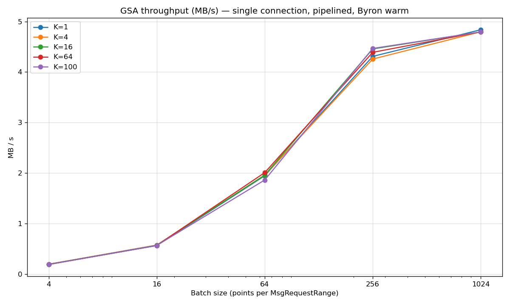
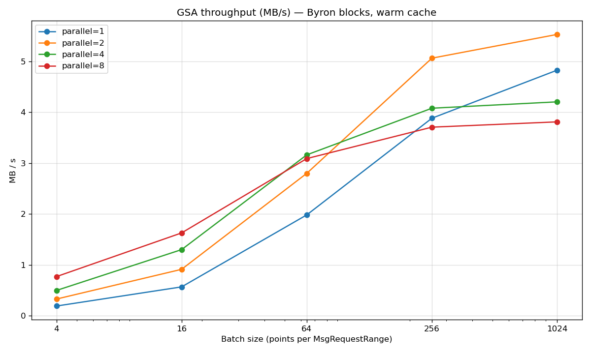
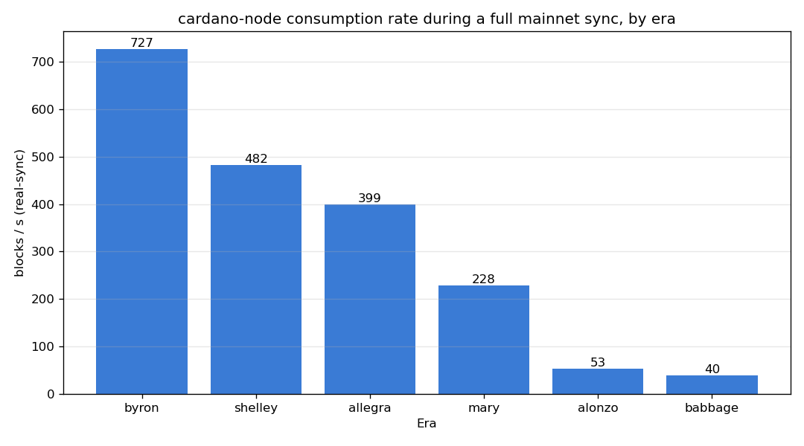

# Performance Report

During `mainnet` testing, we realized that unfortunately, syncing through GSA did not reduce synchronization time for a fresh `cardano-node` instance.

We tried to determine where the bottleneck was. Was GSA itself not serving blocks fast enough to the syncing node, or was `cardano-node` responsible and if so, why ? We evaluated GSA's throughput capabilities versus `cardano-node`'s effective consumption rate, by:

- evaluating GSA's raw performance capabilities 
- inspecting `cardano-node`'s effective consumption patterns when syncing a GSA instance.

## `gsa-bench`

The `gsa-bench` utility is a synthetic ChainSync + BlockFetch client that requests blocks from GSA as fast as possible without
doing any processing and computes global throughput. To characterise GSA's serving capacity we vary three parameters across the runs below:

- `--batch-size` — points per BlockFetch `MsgRequestRange`, controlling how aggressively per-request overhead is amortised across blocks.
- `--max-in-flight` — pipeline depth on a single connection.
- `--parallel` — number of concurrent fake-node connections.

### Performance numbers

Here are some example numbers for GSA on a mid-range development laptop (AMD Ryzen AI 9 365, 32 GiB RAM).

Two observations:

- `--batch-size` greatly benefits throughput by amortizing fixed per-requests costs (in the order of 20ms). This effect shows up to N=256 after which point the curve flattens.
- `--max-in-flight` does *not* increase throughput locally, likely because round-trip time is so small there is nothing for pipelining to amortize on loopback.

Adding multiple parallel connections gives some gains:

Note however that this mimics a multi-client scenario, not our single cardano-node example.

So effective peak throughput per conneciton is in the order of 5 MB/s. This is not great and could likely be improved, but is it sufficient ?

## Actual Sync Numbers

To answer this we look at what `cardano-node` actually pulls blocks during a real mainnet sync, era by era.

The rate decays roughly an order of magnitude across the chain — ~727 blocks/s in Byron down to ~40 blocks/s in Babbage. Even the fastest era, Byron, asks for blocks at a rate well below GSA's 4–5 MB/s single-connection ceiling (727 blocks/s × ~865 B/block ≈ 0.6 MB/s), and the gap only widens later.

## Conclusion

It seems that GSA is not the bottleneck: `cardano-node` requests blocks at a relatively low rate, and this rate decreases  drastically in later eras. The most likely reason is that the whole process is compute-bound ty the apply logic of incoming blocks to the ledger state.